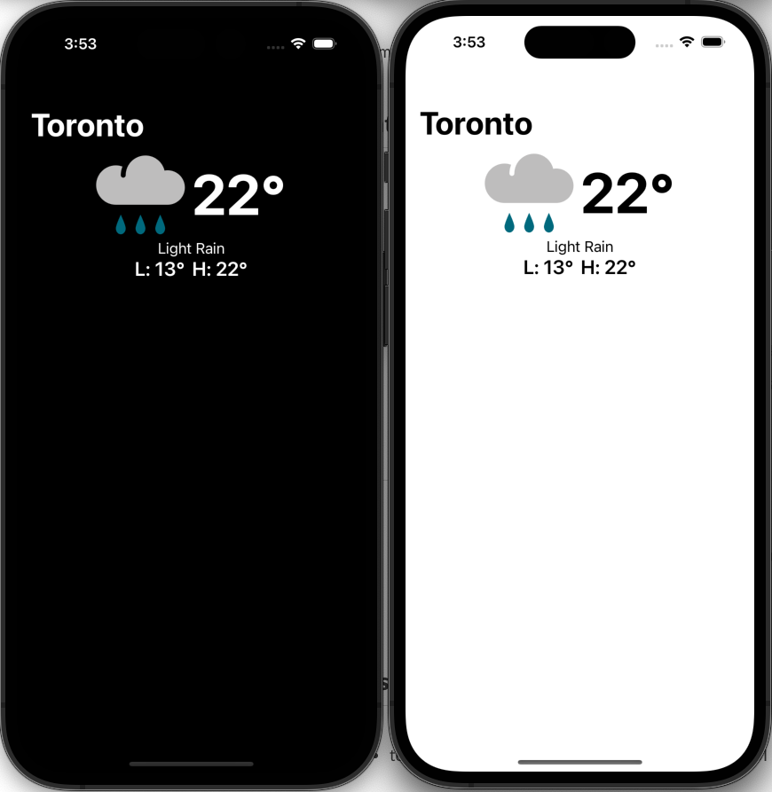

# weather-app
example weather app by landonr

## Data
- loads the data into a swift struct. Services are split into Local and HTTP to make testing and development easier
- WeatherManager for weather data
	 - FileWeatherService file loading service
	 - HttpWeatherService http loading service
- IImageService
	- Loads images from http or locally
- A view model is held to keep track of loading the data for the UI
	- formatting is done inside of the cells because it's specific to that area currently
	
## UI
 - ViewController
	- Holds a collectionview for the weather data. Lets us show the future forecast easily. Cells are automatic height
 - Cells can show celcius or fahrenheit 

## Tests
 - tests data in JSON matches what we expect for the UI

## Includes
- Storyboards (for speed)
- RxSwift
- RxDataSources
- AlamoFire
- SDWebImage
- RxBlocking (for tests)